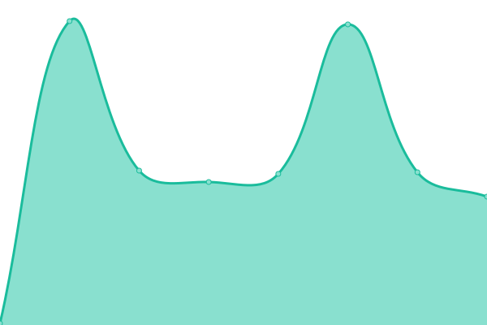

# [📈 Live Status](https://dingo.path08.gq): <!--live status--> **🟧 Partial outage**

This repository contains the open-source uptime monitor and status page for [PATH08](https://path08.gq), powered by [Upptime](https://github.com/upptime/upptime).

<!--start: status pages-->
<!-- This summary is generated by Upptime (https://github.com/upptime/upptime) -->
<!-- Do not edit this manually, your changes will be overwritten -->
<!-- prettier-ignore -->
| URL | Status | History | Response Time | Uptime |
| --- | ------ | ------- | ------------- | ------ |
|  [Google](https://www.google.com) | 🟩 Up | [google.yml](https://github.com/PATH08/dingo/commits/HEAD/history/google.yml) | 

 92ms
     
 | 

<a href="https://dingo.path08.gq/history/google">100.00%</a>
    

|  [Youtube](https://www.youtube.com) | 🟩 Up | [youtube.yml](https://github.com/PATH08/dingo/commits/HEAD/history/youtube.yml) | 

 262ms
     
 | 

<a href="https://dingo.path08.gq/history/youtube">100.00%</a>
    

|  [PATH08's Site](https://www.path08.gq) | 🟥 Down | [path-08-s-site.yml](https://github.com/PATH08/dingo/commits/HEAD/history/path-08-s-site.yml) | 

 583ms
     
 | 

<a href="https://dingo.path08.gq/history/path-08-s-site">100.00%</a>
    

|  WHAT? | 🟥 Down | [what.yml](https://github.com/PATH08/dingo/commits/HEAD/history/what.yml) | 

 243ms
     
 | 

<a href="https://dingo.path08.gq/history/what">100.00%</a>
    

<!--end: status pages-->

[**Visit our status website →**](http://dingo.path08.gq)

## 📄 License

- Powered by: [Upptime](https://github.com/upptime/upptime)
- Code: [MIT](./LICENSE) © [PATH08](https://path08.gq)
- Data in the `./history` directory: [Open Database License](https://opendatacommons.org/licenses/odbl/1-0/)
